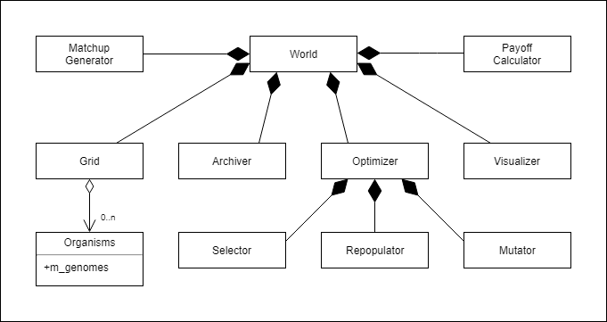
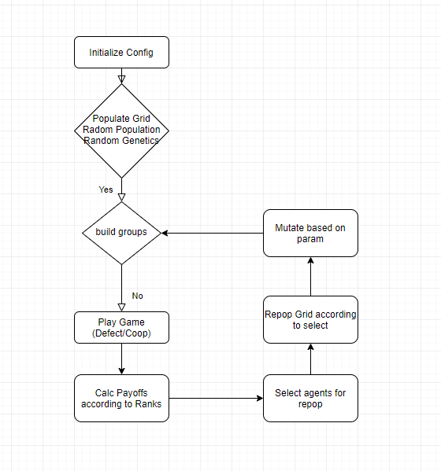
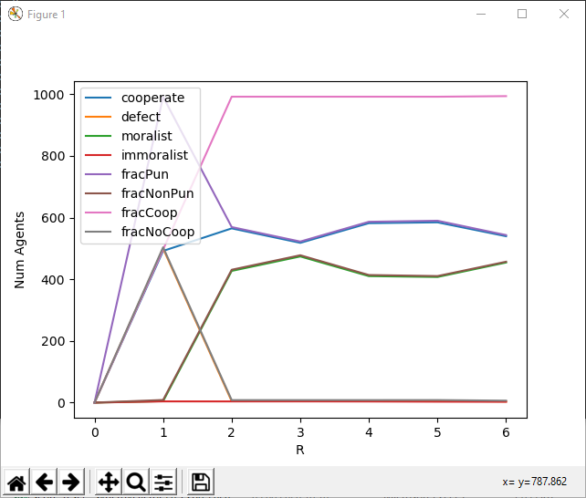
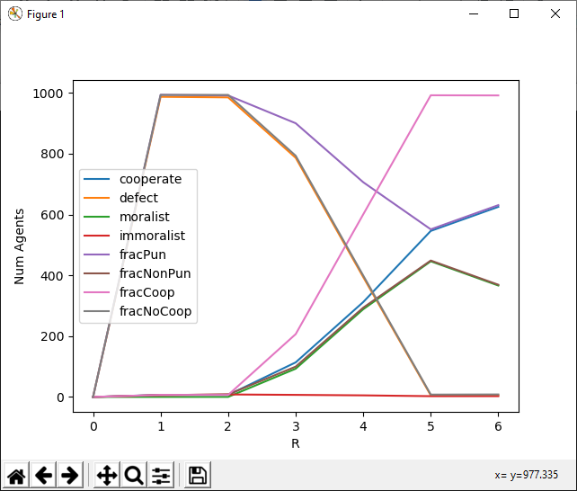
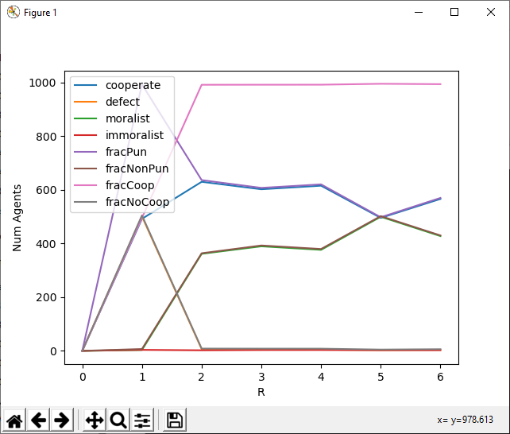

## Abstract /Summary
The APGG (Asymmetric Public Goods Games) C++ framework offers an easy to use environment in which evolutionary asymmetric public goods games can be modeled and simulated. The modular architecture allows for a vast amount of scenarios for different public goods games setups and experiments, using easy to change parameters. This includes experiments on well mixed and structured populations as well as experiments with symmetric and asymmetric payoffs. It also features group level payoffs and individual payoffs, and different evolutionary selectors and repopulators.
Results are automatically saved in semantic and descriptive structures and can be easily visualized with the included Python script.
This paper aims to explain the functionality and the structure of our framework, to show off the workflow that APGG follows, to present the different modules that are available to use and to show how APGG can be used to run public goods games experiments, using a sample scenario, 
[Experimente von anderen evtl reinpacken]

## Introduction  / Lit Review
Asym. Public Good Games have been conducted for years. List papers here. Before computational used math? And then people wrote own SW. We made it our goal to write a OSS framework that is modular to allow researchers in CS and Else to use alike. Bla bla bla. 
## What is a public a goods game 
Super Basic
A good real life example for a public goods game is the clearing of trees. In this case, trees are a public resource and everyone can harvest them. In a very simple case, you have two types of people: Cooperators and Defectors. Cooperators are people who not only harvest trees, but also plant new saplings. Defectors are people who only harvest. [] This setup can lead to a moral dilemma, because the Defector generates more profit due the fact that he doesn’t have to spend time planting new saplings. But if everyone only harvest without planting, the public resource will be gone after some time (tragedy of the commons). [Option: if you transfer this example to a public goods game, you’ll get the following setup explain a, ß, r, Cooperator, Defector, Moralist, Imoralist …]
There are some options to avoid the tragedy of the commons:
- Synergiefaktor erklären
- introduce a punishment system, which allows to punish the Defectors. With a punishment system, everyone can pay a little pit to punish the defector (punishmentCost). The number of punishers are counted and multiplied by a fine (punishmentFine), which has to be paid by the defector. This leads to the fact, that every player has two attributes (Cooperate/Defect, Punish/not Punish), which will result in a matrix of 4 groups

| x        | Not punish           | Punish  |
| ------------- |:-------------:| -----:|
| Cooperate      | cooperator | moralist |
| defect      | defector      |   immoralist |

## Statement of need

APGG is needed because it is great and fast and fast and great!
No other framwork exists yet. 
This literature show it well.

## Code overview

*Temp UML Diagram*

**World**: Encapsulates a single experiment. The World Class is divided into 4 methods, init, tick(plays the game), evolve and fini The main loop (tick and evolve) is being run within the world class and controls the entire game, by calling all the relevant classes and methods. All other classes are being initialized within the world class. World has no subclasses and is used for every experiment. 

**Grid**: The grid is home to all organisms (the population), and functions as the playing field/ game board for the simulation. Grid does not necessarily have to be a “grid”. All organisms are initialized onto the grid and the population will play, compete and evolve on the grid.
	The grid can either be used as a “grid” (spatialGrid), just like the word would suggest, where the spatial location of the organisms matters and is taken into consideration for the simulation, and in the “defaultGrid” mode, where the grid only stores the organisms, but where it does not affect the games and evolution (well mixed population)

**Organism**: The organisms in APGG are the class for the agents that participate in the evolutionary public goods games, being played on the grid. Depending on the grid size, a fixed number of organisms will be spawned to fill up the grid. Organisms hold their Genomes which in turn hold the information that determines how they will act during the games, if they will cooperate, and punish or if they will not so to speak. The Genomes are also used when the selection and repopulation process are being conducted and the organisms offspring will be built from those Genomes.

**Archiver**: The Archiver Class represents a “Log”-Class. It has 2 subclasses. The Simplearchiver, which will write the status of the current generation (number of cooperators, defectors) as well as the LODArchiver, which will print the whole Line of Descent (best organism and his ancestors to a file at the end of each experiment. 

**Mutator**: The mutator is responsible for mutating a random number of organisms out of the selection. The chance for the organisms to mutate is set by the mutationRate parameter. If a random value between 0 and 1 exceeds the mutationRate, one of the genomes of the organism will be randomly reassigned. Besides the normal (default) mutator, there is a threshold mutator, which will reassign the genome a new value within a specific range of the current value.

**PayOffCalculator**: The payoff calculator is the core calculation class of the apgg framework.
 It’s used to calculate the punishment cost and the punishment fine the payoff per group is based on the previously assigned factions (cooperator, defector, …) 

The payoff calculation is a two step process. In the first step, the base costs, fines and payoff are calculated. The second step calculates the individual payoff based on the organism's decision. Depending on his decision, the organism has to pay a punishment cost or a fine out of his individual payoff.There are payoff calculators for different scenarios: Asymmetric Payoff calculator - a calculator, which calculates the payoff based on a spatial tier list. Everyone transfers his individual payoff into a group pool. After that, everyone gets his individual payoff out of this pool based on his rank in the group [hyänen paper].

 The it’sNotReallyAGroupLevelPayoffCalculator [Ref zum Staudacher und Hintze Paper] is a calculator where everyone transfers only a part of his payoff into a group pool. After everyone has paid into this pool, the pool will be splitted by the number of group members and the value will be added to the individual payoff.

## Workflow

*Temp flow chart*

APGG was designed to be an easy to use framework for public goods games experiments. Because of that, the workflow was designed to be straight forward, and not just for computer scientists. To set up and configure an experiment or a set of them, all the user has to do is edit a csv file in the spreadsheet software of their choice or use the shipped python generator to create a batch (umschreiben) and then start the executable. 
Internally, APGG starts by initializing the grid, with its population and all the genomes belonging to them. From there on out it enters the main loop, where it first generates the groups in which the games are being played, which is also the next step. After the games have concluded, the payoffs for each organism will be calculated. These payoff values are then used to make the selection of surviving versus dying on the population. Once the selection was created, the grid will be repopulated, filling in the holes left behind by the dead organisms. Then mutation is applied to the newly generated organisms. After that the loop starts over again.

## Proof of Concept

These exeriemnts show that APGG works super well!!

 
*Temp graph*

 
*Temp graph*

 
*Temp graph*

Great graphs, so good.

## Outlook
Since APGG is written in a modular fashion, adding to and expanding on the existing code base is easy to do, and therefore allows anyone who would want to conduct experiments to write their specific use cases into APGG. Such additions could include ______. These additions could then be added to the official github repository via pull requests. APGG will also remain under further development for future experiments by Professor Dr. Staudacher and Professor Dr. Hintze, which will also be committed to the repository. 
With the architecture that was designed to be easy to use, run, implement and expand, APGG should allow a multitude of possible users an easy passageway into computed public goods games, no matter their level understanding of programming and computational processes. 

## References

1 NAME NAME PAPER JOURNAL DATUM
1 NAME NAME PAPER JOURNAL DATUM
1 NAME NAME PAPER JOURNAL DATUM
1 NAME NAME PAPER JOURNAL DATUM
1 NAME NAME PAPER JOURNAL DATUM
1 NAME NAME PAPER JOURNAL DATUM
1 NAME NAME PAPER JOURNAL DATUM
1 NAME NAME PAPER JOURNAL DATUM
1 NAME NAME PAPER JOURNAL DATUM
1 NAME NAME PAPER JOURNAL DATUM
1 NAME NAME PAPER JOURNAL DATUM
1 NAME NAME PAPER JOURNAL DATUM
1 NAME NAME PAPER JOURNAL DATUM
1 NAME NAME PAPER JOURNAL DATUM
1 NAME NAME PAPER JOURNAL DATUM
1 NAME NAME PAPER JOURNAL DATUM
1 NAME NAME PAPER JOURNAL DATUM
1 NAME NAME PAPER JOURNAL DATUM
1 NAME NAME PAPER JOURNAL DATUM
